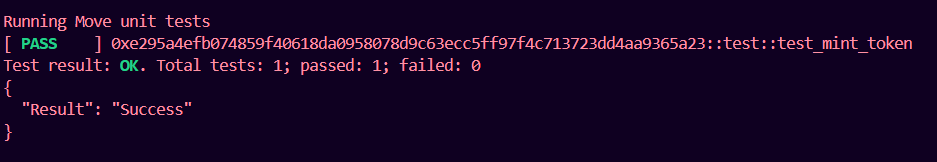
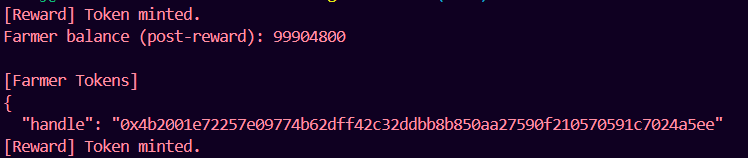

# Backend Setup Guide

This README provides step-by-step instructions for initializing Aptos CLI, testing, deploying, and publishing Move modules, as well as running the Python backend. It also includes example environment variables and a sample `Move.toml` for future reference.

---

## 1. Aptos CLI Initialization

Initialize Aptos CLI and create a new account:

```bash
aptos init
# Follow prompts to set up your profile and network (choose testnet for testing)

aptos account create
# Save the generated address and private key
```

Fund your account on devnet:
```bash
aptos account fund-with-faucet --account <your_address>
```

---

## 2. Move Module: Test, Build, and Publish

### Test Move module
```bash
aptos move test
```

After running the above command, you should see output similar to:



### Build Move module
```bash
aptos move compile
```

### Publish (Deploy) Move module
```bash
aptos move publish --profile default
# Or specify a profile if you have multiple
```

---

## 3. Run Python Backend

Install dependencies (if not already):
```bash
uv pip install
```

This will install from pyproject.toml and uv.lock

Run the backend (using `uv` for hot-reload):
```bash
uv main.py
# Or, if using FastAPI/uvicorn:
uvicorn main:app --reload
```

Or run directly:
```bash
python account.py
```

After running the above command, you should see output similar to:



---


## 4. Example `.env` File

```
PETRA_PRIVATE_KEY= ed25519-priv-0x<your_admin_private_key>
FARMER_PRIVATE_KEY= ed25519-priv-0x<your_farmer_private_key>
```

---

## 5. Example `Move.toml`

```
[package]
name = "backend"
version = "0.0.1"
upgrade_policy = "compatible"

[addresses]
carbon = "0x<your_admin_address>"
admin = "0x<your_admin_address>"
recipient = "0x<your_farmer_address>"
aptos_framework = "0x1"

[dependencies]
AptosFramework = { git = "https://github.com/aptos-labs/aptos-core.git", subdir = "aptos-move/framework/aptos-framework", rev = "main" }
```

---

## Notes
- Always update the addresses in `Move.toml` and `.env` if you create new accounts.
- The Python backend expects the correct private keys in `.env`.
- For each new Move module deploy, use a fresh address to avoid module name clashes on devnet.

---

Feel free to copy-paste and adapt these commands as needed for your workflow!
