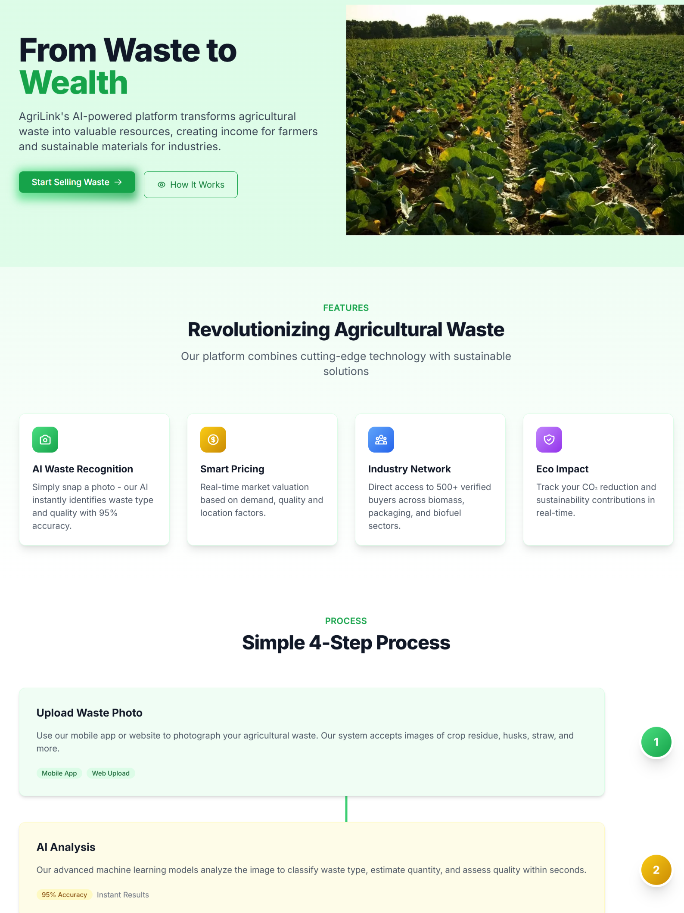
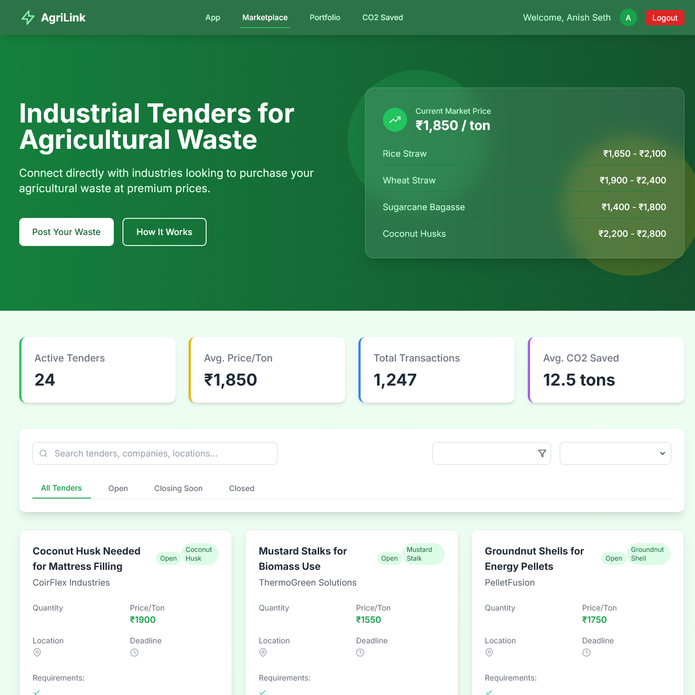
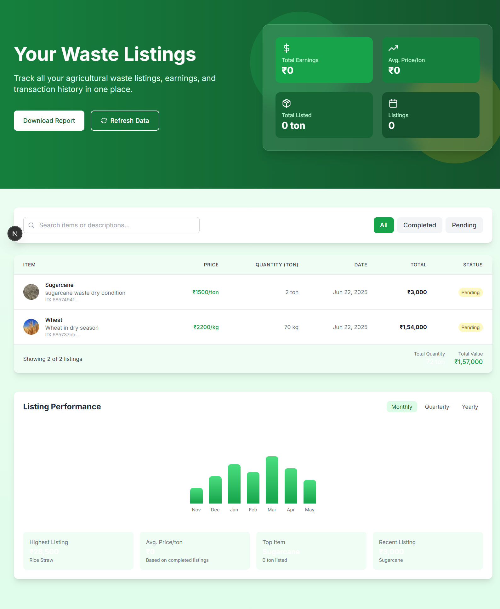

<div align="center" style="background: linear-gradient(90deg,#e0f2fe 0%,#bbf7d0 100%); padding: 2.2rem 1rem 2rem 1rem; border-radius: 1.5rem; box-shadow: 0 8px 32px 0 rgba(16,185,129,0.15); margin-bottom:2rem;">
  <span>
    <svg class="h-16 w-16 text-green-400 mx-auto mb-2" viewBox="0 0 24 24" fill="none" stroke="currentColor"><path stroke-linecap="round" stroke-linejoin="round" stroke-width="2" d="M13 10V3L4 14h7v7l9-11h-7z"></path></svg>
  </span>
  <h1 style="font-size:2.3rem; font-weight:900; margin-bottom:0.5rem; letter-spacing:-1px; color:#14532d;">
    🌱 <span style="color:#16a34a">AgriLink Frontend</span> <span style="color:#333">— Next.js & Tailwind CSS</span>
  </h1>
  <h3 style="font-style:italic; color:#22c55e; font-weight:600; margin-bottom:1.2rem; font-size:1.1rem;">Transforming Agricultural Waste into Wealth</h3>
  <div style="margin-bottom:1.2rem;">
    
    
    
    
    
    
  </div>
  <p style="color:#334155; font-size:1.08rem; max-width:700px; margin:1.5rem auto 0 auto; background:rgba(255,255,255,0.7); border-radius:0.75rem; padding:1.1rem 1.3rem; box-shadow:0 2px 8px 0 rgba(16,185,129,0.07);">
    <b>AgriLink Frontend</b> is a modern, mobile-first web application built with Next.js and Tailwind CSS. It delivers a seamless, secure, and beautiful user experience for farmers and industry, enabling the monetization of agricultural waste and promoting a sustainable, circular economy.<br/><br/>
    <b>✨ Highlights:</b> Civic Auth login, AI-powered waste recognition, live portfolio, carbon wallet, and a responsive, animated UI.
  </p>
</div>

---

## ✨ Key Features

- <b>Decentralized Login (Civic Auth):</b> Secure, privacy-first authentication and session management.
- <b>AI Waste Recognition (Gemini API):</b> Instantly classify waste and get smart price suggestions.
- <b>Live Portfolio & Carbon Wallet:</b> Real-time listings, transactions, and token balances from MongoDB.
- <b>Marketplace & Industry Network:</b> List waste, receive offers, and connect with 500+ verified buyers.
- <b>Impact Tracking:</b> Track CO₂ reduction, waste monetized, and earnings in real time.
- <b>Mobile-First, Modern UI/UX:</b> Fully responsive, animated, and accessible design.
- <b>Secure & Scalable:</b> All data securely stored, robust session logic, and scalable architecture.

---

## 🏗️ Project Structure

```text
frontend/
├── app/            # Main Next.js app directory (pages, layouts, components)
│   ├── components/ # Reusable UI components (Navbar, Hero, etc.)
│   ├── actions/    # Server actions for MongoDB and business logic
│   ├── api/        # API routes for authentication, Gemini, and more
├── lib/            # Utility libraries (MongoDB connector, user utilities)
├── public/         # Static assets and images
├── ...             # Config files, styles, etc.
```

---

## 🚀 Getting Started

1. <b>Install dependencies:</b>
   ```bash
   npm install
   # or
yarn install
   ```
2. <b>Set up environment variables:</b>
   - Create a <code>.env.local</code> file in the <code>frontend</code> directory with your API keys and MongoDB connection string.
3. <b>Run the development server:</b>
   ```bash
   npm run dev
   # or
yarn dev
   ```
4. <b>Open <a href="http://localhost:3000">http://localhost:3000</a> in your browser.</b>

---

## 🛠️ Tech Stack & Integrations

- <b>Next.js:</b> Modern React framework for SSR, SSG, and API routes
- <b>Tailwind CSS:</b> Utility-first CSS for rapid, beautiful UI
- <b>Civic Auth:</b> Decentralized, privacy-preserving authentication
- <b>Gemini API:</b> AI-powered waste recognition and smart pricing
- <b>MongoDB:</b> NoSQL database for all user, listing, and transaction data
- <b>Supabase:</b> Storage for image uploads

---

## 🔒 Authentication & Security
- Civic Auth for decentralized, privacy-preserving login
- Custom JWT/session handler for secure user sessions
- Route protection middleware for all key pages

## 🤖 AI & Data
- Gemini API for smart, real-time price estimation
- MongoDB for all user, listing, and transaction data
- Live portfolio and carbon wallet with fallback to mock data

## 🌱 Sustainability Impact
- Track CO₂ savings and waste monetized
- Empower farmers to earn from waste, reduce open burning, and support industry sustainability

---

## 📦 Deployment

Deploy easily on <a href="https://vercel.com/">Vercel</a> or your preferred platform. See Next.js docs for more details.

---

## 📸 Screenshots

| Home (Desktop) | Marketplace | Portfolio (Mobile) |
|---|---|---|
|  |  |  |

---

## 📚 Learn More
- [Next.js Documentation](https://nextjs.org/docs)
- [Tailwind CSS](https://tailwindcss.com/)
- [Civic Auth](https://www.civic.com/)
- [Aptos Blockchain](https://aptosfoundation.org/)
- [Gemini API](https://ai.google.dev/gemini-api/docs)
- [MongoDB](https://www.mongodb.com/)
- [Supabase](https://supabase.com/)

---

> **AgriLink: From Waste to Wealth — Empowering Farmers, Fueling Industry, Sustaining the Planet.**
